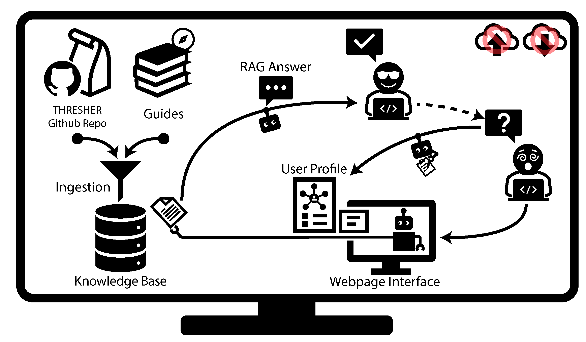

# **THRESHER-Chat**

THRESHER-Chat is a local, offline AI assistant for [THRESHER](https://github.com/microbialARC/THRESHER/).
It answers questions about THRESHER from its source code, documentation, and a set of curated
guides, and cites the source files behind each answer.

Everything runs on your own machine: no account and no cloud service, and your questions and
files never leave your computer.

THRESHER-Chat does **not** run THRESHER, process genomes, compute SNP distances, or produce
phylothresholds, strains, or transmission clusters. To analyze data, install and run
[THRESHER](https://github.com/microbialARC/THRESHER/) itself.

## **Graphical Workflow**

## Documentation
### Getting Started
- [Requirements](docs/requirements.md)
- [Installation](docs/installation.md)
- [Quick Start](docs/quick_start.md)
### Usage
- [Usage (Ingest)](docs/usage_ingest.md)
- [Usage (Server)](docs/usage_server.md)
- [Web Interface](docs/web_interface.md)
- [User Memory](docs/user_memory.md)
### Advanced Usage
- [Usage (Terminal Chat)](docs/usage_chat.md)
- [Troubleshooting](docs/troubleshooting.md)
- [Response Profiles](docs/response_profiles.md)

### Getting help

- For questions about **THRESHER** that the assistant can't answer, see the
  [THRESHER documentation](https://github.com/microbialARC/THRESHER/tree/main/docs) or open an issue on the
  [THRESHER repository](https://github.com/microbialARC/THRESHER/issues).
- For problems with **THRESHER-Chat** itself, start with [troubleshooting](docs/troubleshooting.md), then
  open an issue on the [THRESHER-Chat repository](https://github.com/microbialARC/THRESHER-Chat/issues).

## Authors

**Qianxuan (Sean) She**

## Acknowledgments
Developed under the mentorship of:

**Dr. Paul J. Planet**  
Email: planetp@chop.edu

**Dr. Ahmed M. Moustafa**  
Email: moustafaam@chop.edu

**Dr. Joseph P. Zackular**  
Email: joseph.zackular@pennmedicine.upenn.edu
##