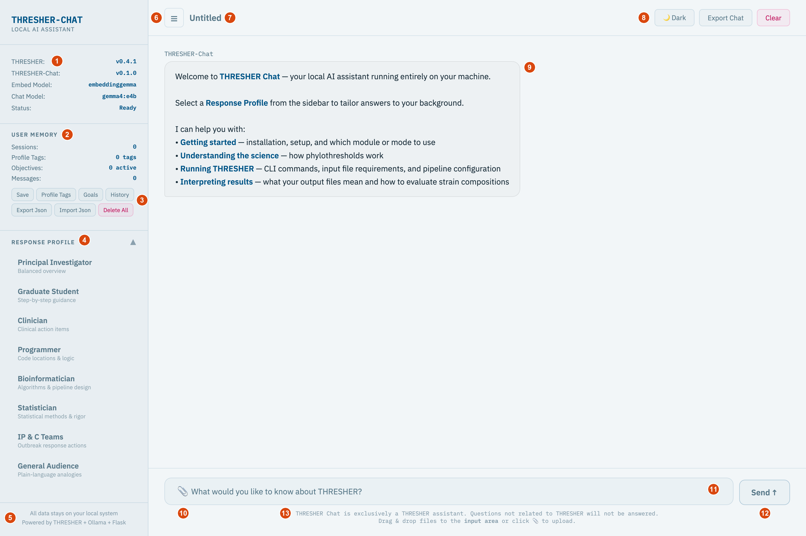

# The web interface

The web interface is the main way to use THRESHER-Chat. Start it with
[`thresher-chat server`](usage_server.md) and open <http://127.0.0.1:5000> in your browser.

Like the rest of THRESHER-Chat, the web interface only explains THRESHER. It can't run THRESHER or analyze your data.

| # | Element | What it does |
|---|---|---|
| 1 | [Status panel](#status-panel) | THRESHER and THRESHER-Chat versions, models in use, and connection status |
| 2 | [User Memory](#user-memory) | Counters showing what the assistant remembers about you |
| 3 | [Memory buttons](#user-memory) | Save, review, export, import, or delete that memory |
| 4 | [Response Profile](#response-profile) | Choose who you are so answers match your background |
| 5 | Sidebar footer | Reminder that all data stays on your computer |
| 6 | [Sidebar toggle](#header-bar) ☰ | Hide or show the sidebar |
| 7 | [Conversation title](#header-bar) | A short title generated from your first question |
| 8 | [Dark, Export Chat, Clear](#header-bar) | Theme, save the conversation as text, or start over |
| 9 | [Conversation](#conversation) | Questions, answers, and the source files each answer used |
| 10 | [Upload](#uploading-files) 📎 | Attach a text file for the assistant to read |
| 11 | [Question box](#asking-questions) | Type your question about THRESHER |
| 12 | [Send](#asking-questions) | Send the question (or press **Enter**) |
| 13 | Input notes | Reminders: THRESHER questions only, and how to upload files |

## Sidebar

### Status panel

At the top of the sidebar, the status panel **(1)** shows:

| Row | Meaning |
|---|---|
| **THRESHER** | Version of the THRESHER repository you ingested. The assistant's knowledge matches this version. |
| **THRESHER-Chat** | Version of THRESHER-Chat you're running |
| **Embed Model** | Model used to find relevant passages |
| **Chat Model** | Model writing the answers |
| **Status** | `Ready` when connected to the server, `Offline` when it can't reach it |

If **THRESHER** shows `Unknown`, the THRESHER folder was moved or deleted after ingest.
[Re-ingest](usage_ingest.md#when-to-re-run-ingest) from its current location.

### User Memory

THRESHER-Chat can remember useful context between conversations, such as your role and research goals.
Full details are in [user_memory.md](user_memory.md).

**Counters (2)**

| Counter | Meaning |
|---|---|
| Sessions | Number of saved conversations |
| Profile Tags | Short descriptions of you inferred from conversations, e.g. *clinical microbiologist* |
| Objectives | Research goals that are still active |
| Messages | Total stored questions and answers |

**Buttons (3)**

| Button | What it does |
|---|---|
| **Save** | Summarizes the current conversation and extracts profile tags and goals from it. Needs at least one question and answer. |
| **Profile Tags** | Opens the list of tags. Mark a tag incorrect (✗) so it's ignored and never re-added, reactivate it (◻), or delete it (🗑). |
| **Goals** | Opens your research objectives. Mark one completed (✅), reactivate it (◻), or delete it (✕). |
| **History** | Shows summaries of past conversations, with date and message count |
| **Export Json** | Downloads all memory as `thresher-chat-memory-<date>.json` |
| **Import Json** | Loads a previously exported file and merges it into your current memory |
| **Delete All** | Permanently deletes all memory after you confirm |

Click a button again to close its list.

### Response Profile

Click **Response Profile (4)** to expand or collapse the list, then click the profile that best describes you.
The assistant confirms the switch in the conversation, and later answers are tailored to that background:

| Profile | Focus |
|---|---|
| Principal Investigator | Balanced overview |
| Graduate Student | Step-by-step guidance |
| Clinician | Clinical action items |
| Programmer | Code locations & logic |
| Bioinformatician | Algorithms & pipeline design |
| Statistician | Statistical methods & rigor |
| IP & C Teams | Outbreak response actions |
| General Audience | Plain-language analogies |

You can switch profiles at any time. A profile changes how answers are explained, not which sources they use.
See [response_profiles.md](response_profiles.md), including how to add your own profile.

## Header bar

| Element | What it does |
|---|---|
| **☰ (6)** | Hides or shows the sidebar. Your choice is remembered. |
| **Title (7)** | Starts as *Untitled*. After the first answer, a short title is generated from your question. |
| **Dark / Light (8)** | Switches between dark and light themes. Your choice is remembered. |
| **Export Chat (8)** | Downloads the conversation as a text file named `<title>_<date>.txt` |
| **Clear (8)** | Saves the conversation to memory, then starts a new one. Uploaded files are removed and the title resets. |

## Conversation

The conversation area **(9)** shows the welcome message, your questions (**You**), and the answers (**THRESHER-Chat**).
While an answer is being written, three animated dots appear.

Under each answer, gray labels list the **source files** the answer drew from, such as `thresher_overview.md`.
Uploaded files you've attached are listed there too. Check these sources when an answer matters.

The assistant follows strict rules:

- It answers only from THRESHER's code, documentation, and the bundled guides, and cites them.
- When the documentation doesn't cover something, it says so instead of guessing.
- It declines questions that aren't about THRESHER.

## Asking questions

1. Type your question in the question box **(11)**.
2. Press **Enter** or click **Send (12)**. Send is highlighted once you've typed something.

The assistant remembers the last few exchanges in the current conversation, so you can ask follow-up questions
such as *"What output files does it produce?"*.

Tips for better answers:

- Use THRESHER's own terms: mode names (*Full Pipeline*, *New SNPs*), concepts (*phylothreshold*, *CladeBreaker*),
  or file names.
- Ask one question at a time.
- If an answer seems off, rephrase it or start a new conversation with **Clear**.

See the [example questions](example/example_questions.md) for ideas.

## Uploading files

You can attach a text file, such as a THRESHER metadata table, a log, or an output table, and ask about it.

- Click **📎 (10)** and choose one or more files, or drag and drop files onto the input area.
- The conversation confirms each upload with its line count, character count, and a short preview.
- Each file appears as a label above the question box. Click **×** on a label to remove that file.

| Detail | Value |
|---|---|
| Supported types | `.txt` `.csv` `.tsv` `.tab` `.log` `.fasta` `.fa` `.fna` `.faa` `.gff` `.gff3` `.bed` `.vcf` `.nwk` `.newick` `.nex` `.nexus` `.json` `.yaml` `.yml` `.md` `.rst` |
| Maximum size | 50 MB per file |
| Amount the assistant reads | The first 15,000 characters of each file |
| How long files are kept | Until you remove them, click **Clear**, or stop the server. Files aren't saved to disk. |

The assistant reads uploaded files to answer your questions. It doesn't run THRESHER on them.
Large sequence files will be cut off, so upload small excerpts, metadata, or logs instead.

## A typical session

1. Choose a **Response Profile**.
2. Ask a question, e.g. *"Which mode should I use to add 5 new genomes to an existing run?"*
3. Ask follow-up questions, or upload your metadata file and ask *"Is this metadata in the right format for THRESHER?"*
4. Click **Export Chat** to keep a copy of the answers.
5. Click **Save** so the assistant remembers your goals next time, or **Clear** to save and start a new topic.

When you close or reload the tab, the conversation is saved to memory automatically.
